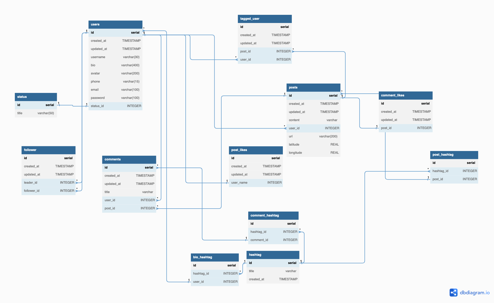

  

# Instagram Schema Model

  

## Description

This repository contains the sql file and the schema created using dbdiagram.io.

  

## Instagram basic model

  

## Use

Paste the ./instagram-schema.dbml into https://dbdiagram.io/d/
